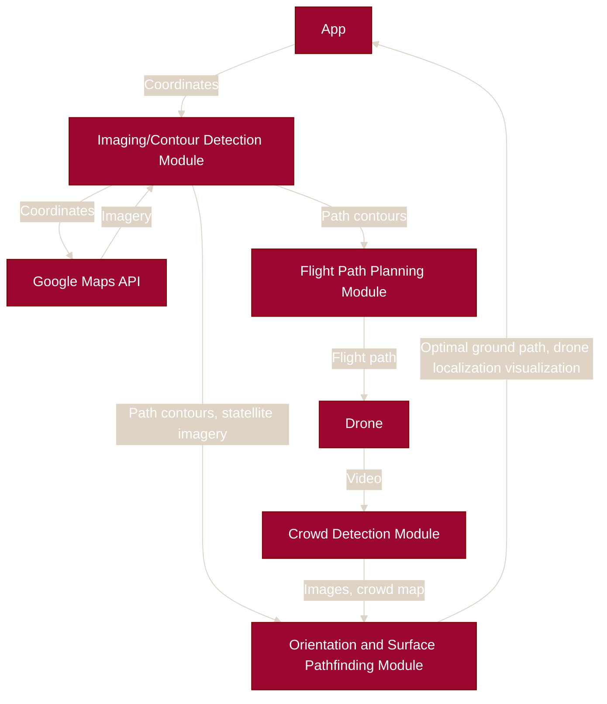

# 

```mermaid
%%{
    init: {
        'theme': 'base',
        'themeVariables': {
            'primaryColor': '#9b072f',
            'primaryTextColor': '#fff',
            'primaryBorderColor': '#7C0000',
            'lineColor': '#ddd3c7',
            'secondaryColor': '#dfd3c5',
            'tertiaryColor': '#fff'
        }
    }
}%%
flowchart TB
    A[App] -->|Coordinates| B[Imaging/Contour Detection Module];
    B -->|Coordinates| C[Google Maps API];
    C -->|Imagery| B
    B -->|Path contours| D[Flight Path Planning Module]
    B -->|Path contours, statellite imagery| E[Orientation and Surface Pathfinding Module]
    D -->|Flight path| F[Drone]
    F -->|Video| G[Crowd Detection Module]
    G -->|Images, crowd map| E
    E -->|Optimal ground path, drone localization visualization| A
```