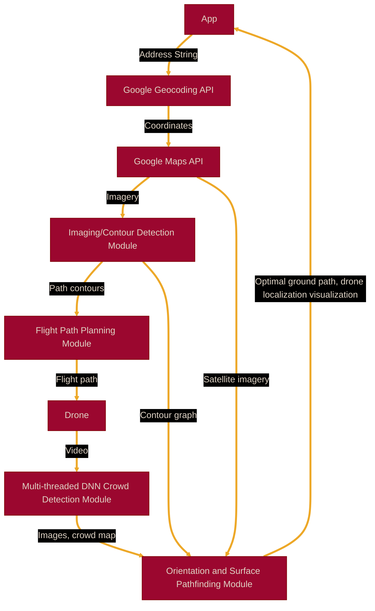

# SkyShepherd

lorem ipsum dolor sit amet

```mermaid
%%{
    init: {
        'theme': 'base',
        'themeVariables': {
            'primaryColor': '#9b072f',
            'primaryTextColor': '#dfd3c5',
            'primaryBorderColor': '#7C0000',
            'lineColor': '#eda828',
            'secondaryColor': '#000',
            'secondaryBorderColor': '#000',
            'tertiaryColor': '#000'
        }
    }
}%%
flowchart TB
    A[App] ==>|Address String| B[Google Geocoding API]
    B ==>|Coordinates| C[Google Maps API]
    C ==>|Imagery| H[Imaging/Contour Detection Module]
    H ==>|Path contours| D[Flight Path Planning Module]
    H ==>|Contour graph| E
    C ==>|Satellite imagery| E[Orientation and Surface Pathfinding Module]
    D ==>|Flight path| F[Drone]
    F ==>|Video| G[Multi-threaded DNN Crowd Detection Module]
    G ==>|Images, crowd map| E
    E ==>|Optimal ground path, drone localization visualization| A
```
