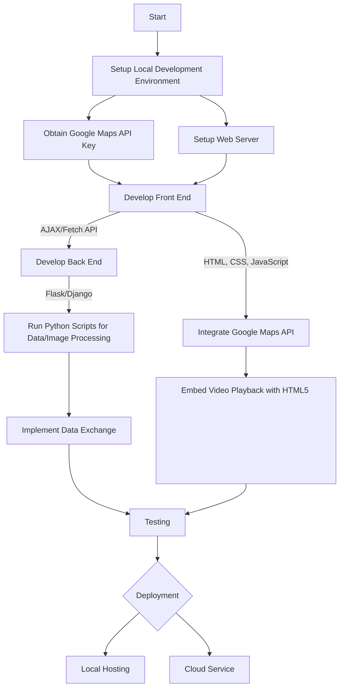

# TartanHacks2024

```mermaid
graph TD;
    A[Start] --> B[Setup Local Development Environment];
    B --> C[Obtain Google Maps API Key];
    B --> D[Setup Web Server];
    C --> E[Develop Front End];
    D --> E;
    E -->|HTML, CSS, JavaScript| F[Integrate Google Maps API];
    E -->|AJAX/Fetch API| G[Develop Back End];
    G -->|Flask/Django| H[Run Python Scripts for Data/Image Processing];
    H --> I[Implement Data Exchange];
    F --> J[Embed Video Playback with HTML5 <video> Tag];
    I --> K[Testing];
    J --> K;
    K --> L{Deployment};
    L --> M[Local Hosting];
    L --> N[Cloud Service];
```