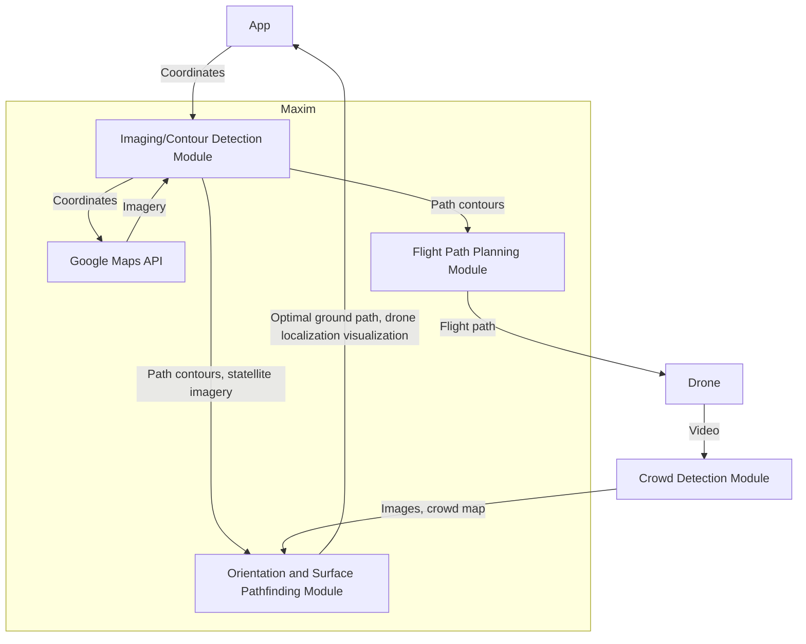

# 

```mermaid
flowchart TB
    A[App] -->|Coordinates| B[Imaging/Contour Detection Module];
    subgraph Maxim
    B -->|Coordinates| C[Google Maps API];
    C -->|Imagery| B
    B -->|Path contours| D[Flight Path Planning Module]
    B -->|Path contours, statellite imagery| E[Orientation and Surface Pathfinding Module]
    end
    D -->|Flight path| F[Drone]
    F -->|Video| G[Crowd Detection Module]
    G -->|Images, crowd map| E
    E -->|Optimal ground path, drone localization visualization| A
```