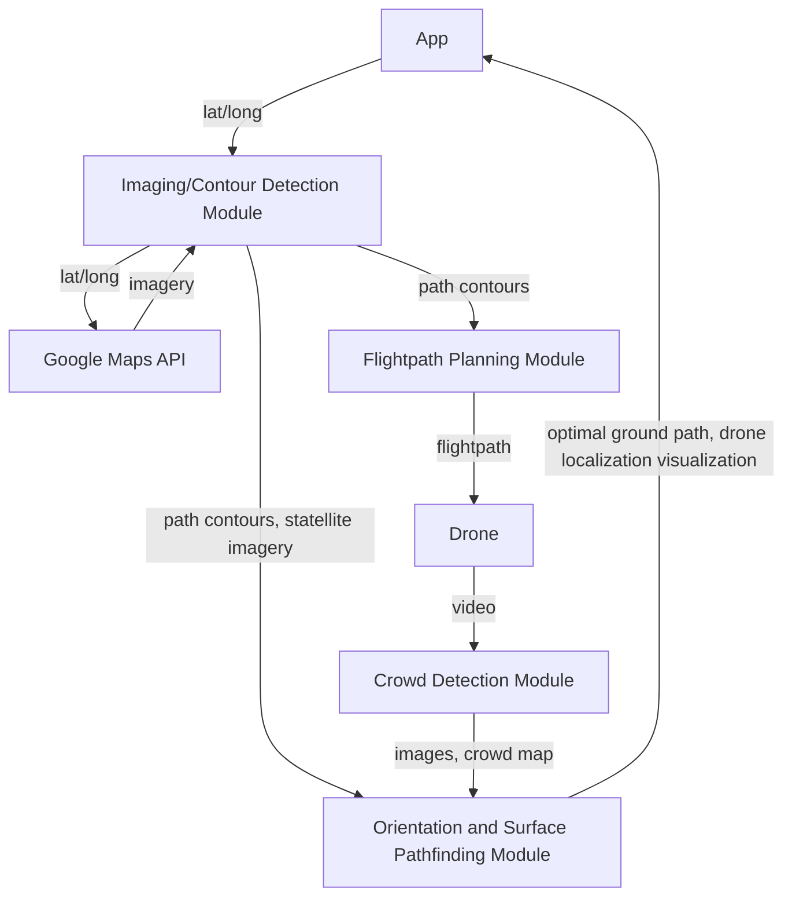

# 

```mermaid
graph TD;
    A[App] -->|lat/long| B[Imaging/Contour Detection Module];
    B -->|lat/long| C[Google Maps API];
    C -->|imagery| B
    B -->|path contours| D[Flightpath Planning Module]
    B -->|path contours, statellite imagery| E[Orientation and Surface Pathfinding Module]
    D -->|flightpath| F[Drone]
    F -->|video| G[Crowd Detection Module]
    G -->|images, crowd map| E
    E -->|optimal ground path, drone localization visualization| A
```