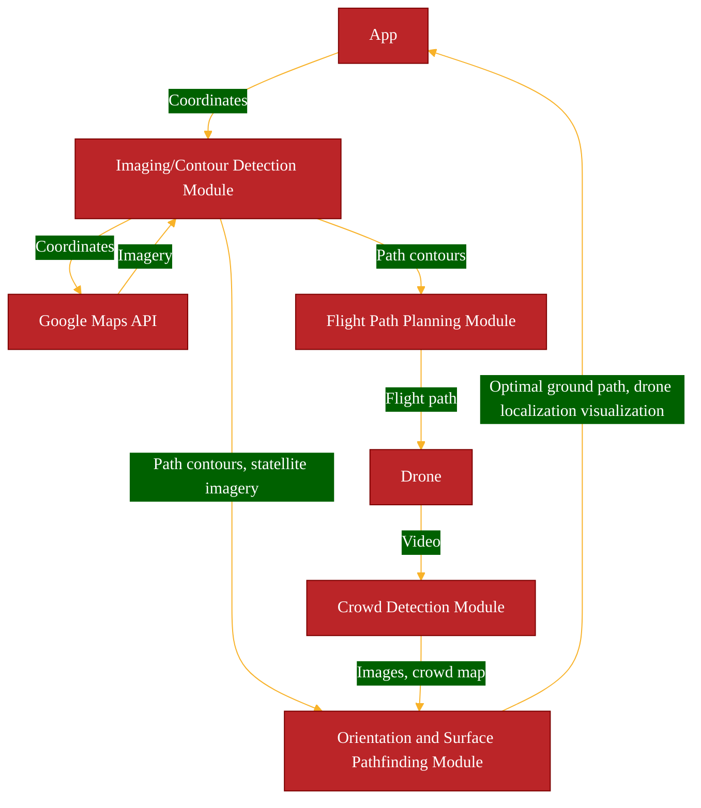

# 

```mermaid
%%{
    init: {
        'theme': 'base',
        'themeVariables': {
        'primaryColor': '#BB2528',
        'primaryTextColor': '#fff',
        'primaryBorderColor': '#7C0000',
        'lineColor': '#F8B229',
        'secondaryColor': '#006100',
        'tertiaryColor': '#fff',
        'fontFamily': 'verdana'
        }
    }
}%%
flowchart TB
    A[App] -->|Coordinates| B[Imaging/Contour Detection Module];
    B -->|Coordinates| C[Google Maps API];
    C -->|Imagery| B
    B -->|Path contours| D[Flight Path Planning Module]
    B -->|Path contours, statellite imagery| E[Orientation and Surface Pathfinding Module]
    D -->|Flight path| F[Drone]
    F -->|Video| G[Crowd Detection Module]
    G -->|Images, crowd map| E
    E -->|Optimal ground path, drone localization visualization| A
```